### 3. System Overall Design

#### 3.1. Environment Setup:

##### 3.1.1. Overview:

The development environment is implemented as in figure xxx:


- **Raspberry Pi** – an 32bit operating system running on Raspberry Pi 4 – is the host machine. Other platform and operating system are also valid, more configurations are needed.
- **Apache Webserver** is the web server installed on the host machine. Please refer to section "3.1.2. Webserver" for installation guide.
- **Virtual network** is the network of 4 differrent virtual machines and runs inside the host machine. Please refer to section "3.1.3. Virtual network" for installation guide.
- **Resources information** is resources parameters (eg. CPU, RAM...) of the host machine.
- **SIEM system** is the system which monitors the Webserver, Virtual network and Resource information of the host machine.

##### 3.1.2. Apache Webserver:

##### 3.1.3. Virtual network:

To set up this virtual network, Docker is used since it provides a lightweight and minimum resources contamination. This section only focuses on set up virtual network on the host machine. For Docker installation please refer to https://phoenixnap.com/kb/docker-on-raspberry-pi.

Follow these steps to set up the virtual network. Open up Terminal and issue these commands:

1. Enter super user mode: 

   ```
   sudo su
   ```

2. Pull images from Docker Hub:

   ```
   docker pull ubuntu
   docker pull httpd
   docker pull redis
   ```

3. Create virtual machines from pulled images and start them:

   ```
   docker create --name vm2 httpd && docker start vm2 # Create and start VM2
   docker create --name vm3 redis && docker start vm3 # Create and start VM3
   docker run -it --name vm4 ubuntu /bin/bash # Create VM4
   exit # Exit created VM4 container
   docker run -it --name vm5 ubuntu /bin/bash # Create VM5
   exit # Exit created VM5 container
   docker start vm4 vm5 # Start VM4, VM5
   ```

4. To see the addresses of those virtual machines in the network, issue this command:

   ```
   docker network inspect bridge
   ```

5. Install the `nmap` tool for the attack machine `vm5`:

   ```
   docker exec -it vm5 /bin/bash # Enter vm5
   apt-get update
   apt-get install nmap -y # Install nmap
   ```

The SIEM system requires listening on the virtual network. Follow these steps to set up:

1. Install `lib4cap` as a library for capturing packets on the host machine.

   ```
   apt-get install libpcap-dev
   ```

2. Project requires Java dependency `Pcap4J` please make sure it is presented in the host machine.

3. Pcap4J needs administrator/root privileges. You can run Pcap4J with a non-root user by granting capabilities `CAP_NET_RAW` and `CAP_NET_ADMIN` to your java command by the following command:

   ```
   setcap cap_net_raw,cap_net_admin=eip /usr/lib/jvm/java-11-openjdk-armhf/bin/java
   ```

   Note: the path above may vary on differrent host machines.

##### 3.1.4. Resources information:

No set up is required for this.

##### 3.1.5. The host machine:

The SIEM system requires the host machine has JavaFX to run. Please make sure JavaFX 11 is installed. Download at https://gluonhq.com/products/javafx/. For development machine, `JavaFX armv6hf SDK` is chosen.

##### 3.1.6. SIEM system:

If you running the project from an IDE, you must specify using JavaFX with the run argument:

```
--module-path /usr/lib/jvm/javafx-arm-sdk/lib --add-modules javafx.controls,javafx.fxml
```

If you run the project by running `run.sh` file. Using JavaFX is already specified.

#### 3.2. System architecture:

#### 3.3. Software architecture:
This section refers how we implement the system proposed in section 3.2 "System architecture" in the aspect of software design. 
##### 3.3.1. Overview:
We have the main package named *SIEMsystem* represents for the system itself. In that, SIEMsystem package is a combination of 5 packages:
- Package *collector*: the package contains Java classes for collecting raw data, creating events (package event) and feeding the *CEPEngine* (package cep).
- Package *cep*: the package contains Java classes for analysing events (package event) and raising the alerts to *AlertManager* (package alert).
- Package *event*: the package contains all Java classes represent for events used in the *CEPEngine*.
- Package *alert*: the package contains all Java classes represent for *AlertManager* and alerts raised by *CEPEngine*.
- Package *dashboard*: the package contains all Java classes which defined a graphical user interface of the system – *Dashboard*.


##### 3.3.2. Package collector:

This package contains Java classes for: collecting raw data from the web server, virtual network and the host machine resource information; creating events from raw data (package event) and feeding the *CEPEngine* (package cep). In particular, this package contains 3 classes:

- WebserverCollector: a class that reads Apache Webserver log file, watches for new logs in realtime, parses new logs into a class – AccessLogEvent – then feeds the CEPEngine with that class.
- ResourceCollector: a class that reads system resource information, creates a class – ResourceMonitorEvent – and feeds the CEPEngine with that class.
- PortscanCollector: a class that captures the TCP packets on a network interface, creates a class – TcpPacketEvent – and feeds the CEPEngine with that class.
- WebserverCollector, ResourceCollector and PortscanCollector are extended from Thread in order to they can run independently and in parallel.


##### 3.3.3. Package cep:

This package contains Java classes for processing events from collectors and raising corresponding alerts (if any). It contains 2 main classes:

- CEPEngine: a class that manages the configurations, its modules, counting events and an entry for collectors send events to.
- Module: an abstract class that là một module đơn giản, nó được tạo ra nhằm để đảm bảo rằng các concrete modules sẽ được kết nối với CEPEngine một cách đúng đắn.

The remaining 3 classes extend Module, they are responsible for defining how events are processed and producing corresponding alerts and send them to the AlertManager (package alert).:

- PortscanModule: this does everything related to port scan monitoring.
- ResourceModule: this does everything related to system resource monitoring.
- WebserverModule: this does everything related to web server monitoring.


##### 3.3.4. Package event:

This package contains Java classes those represent events used in the modules of the CEPEngine. They are grouped into 3 groups:

- Classes related to port scan monitoring: TcpPacketEvent, ClosedPortScanEvent, OpenPortScanEvent, PortScanEvent, ClosedPortConnectionFailureEvent, VerticalPortscanEvent, HorizontalPortscanEvent and BlockPortScanEvent.
- Classes related to system resource monitoring: ResourceMonitorEvent, HighCPUUsageEvent and HighMemoryUsageEvent.
- Classes related to web server monitoring: AccessLogEvent, FailedLoginEvent, ForbiddenEvent, ConsecutiveFailedLoginEvent, and BruteForceAttackEvent.

For the usage of these events, please refer to section "4. System Implementation". 


##### 3.3.5. Package alert:

This package contains Java classes those represent alerts used in the modules of the CEPEngine, AlertManager and Dashboard. It contains 2 main classes:

- AlertManager: a class that attachs predefined priority to the corresponding alert which is raised in modules of CEPEngine and reads/writes priorities of alerts from/to configuration file.
- Alert: an abstract class that forms a uniform for all alerts in order to the client code can treat them as in the same way with no distinction.

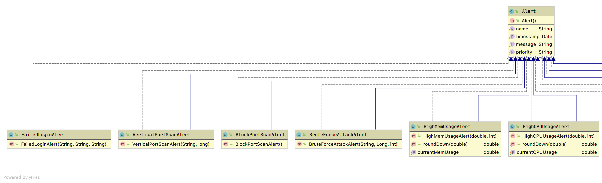

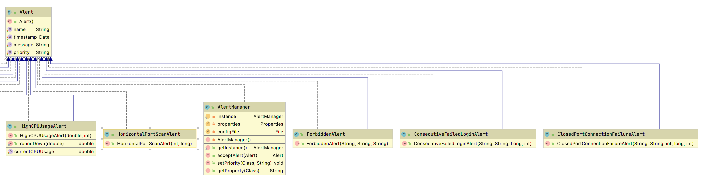


##### 3.3.6. Package dashboard:

This package is the entry of the system, it is about initializing the system engine, displaying the alerts, system configurations, priorities of alerts and number of processed events for each event type. In particular:

- Dashboard: a class that takes responsibility for rendering the main window of the system – alerts are displayed to clients via this window.
- ChangePriority: a class that renders the change priority window – clients use this window to change priorities of alerts.
- EngineConfiguration: a class that renders the engine configuration window – clients use this window to configure the engine of the system.
- RestartNotification: a class that renders the restart notification window – informs clients to restart the system after configuring.
- Counting: a class that renders the event counting window – clients use this window to see the number of processed events for each event type.
- EventCount: a class that represents a data structure for a pair of event type and its number processed events. It is used in Counting class.
- Main: a class that is an entry of the whole system. It initializes the collectors, CEP engine and renders above windows. 


### 4. System description:

#### 4.2. Collectors:

##### 4.2.1 Webserver collector:

This collector catch all the new event that added to the log file of the web server in realtime and send it to the CEPEngine for further processing and analysing

##### 4.2.1.1 Libarary - BufferedReader and Parse:

For reading the log file, we will use BufferReader to buffer the input and improve efficiency. Parse is used to parsing the log to the Java system. 

##### 4.2.1.2 "Webserver" class:

This class implements event capture and sends them to the CEPEngine. It is a Java Thread in order to run independent with other processes. 

We imported serveral classes:

```java
import java.io.BufferedReader;
import java.io.FileReader;
import java.util.ArrayList;
import nl.basjes.parse.core.Parser;
```

We created a static variable to track the number of new lines in the log file so our system do not have to send all the event in the log file to the CEPEngine everytime.

```java
private static int currLog;
```
.
Then to initalize the viriable, we created a class to get the current line of the log file. Let's call it `runfirst`.

```java
private int runfirst() throws IOException{
        
        BufferedReader reader = new BufferedReader(new FileReader(logFilePath));
        int n = 0;
        while (reader.readLine() != null) {
            n+=1;
        }
        reader.close();
        return n;
    }
```

Now we will need an array to store all the new event that our reader just read, then we will send its element to the CEPEngine

```java
ArrayList<AccessLogEvent> event = null;
event = getEvent();
for (int i = 0; i < event.size(); i++) {
   CEPEngine.getCreatedInstance().getRuntime().getEventService().sendEventBean(event.get(i), "AccessLogEvent");
   }
```

For class `getEvent()` above, first we will need to pass `currLog` line in the log file, then after an event is read, we update the `currLog`

##### 4.2.2. Portscan collector:

This collector captures all TCP packets on an network interface, then it sends them to the CEPEngine for further processing and analysing.

Further more, it also enables clients select network interface on the computer. However, not every network interfaces are valid to work with the system, the valid network interfaces are the network of more than or equal to 3 machines that connect to that network and make sure you have the right for capturing packets on it. The virtual network in section "3.1.3 Virtual network" is highly recommended.

##### 4.2.2.1. Library - Pcap4J:

To monitor network connection from within Java, Pcap4J is used. It enables to capture network every packets from the network interface with the help of the libpcap4 native library.

Please refer to section 3.1 "Environment Setup" if you have not set up the environment.

##### 4.2.2.2. "PortscanCollector" class:

This class implements TCP packets capture and sends them to the CEPEngine. It is a Java Thread in order to run independent with other processes. 

We imported several classes of the Pcap4J library:

```java
import org.pcap4j.core.*;
import org.pcap4j.packet.IpV4Packet;
import org.pcap4j.packet.Packet;
import org.pcap4j.packet.TcpPacket;
```

We created an instance of the network interface so that we can manipulate it by using Java, the `nifName` is the network interface name, `docker0` for example:

```java
String nifName = "docker0";
PcapNetworkInterface nif = Pcaps.getDevByName(nifName);
```

Before open the network interface live, we need some parameters:

- `SNAPLEN`: Snapshot length, which is the number of bytes captured for each packet.
- `MODE`:  Capturing mode. We have chosen `PROMISCUOUS` to capture all packets. 
- `READ_TIMEOUT`: Read timeout. Most OSs buffer packets. The OSs pass the packets to Pcap4j after the buffer gets full or the read timeout expires. Must be non-negative. May be ignored by some OSs. 0 means disable buffering on Solaris. 0 means infinite on the other OSs. 1 through 9 means infinite on Solaris.

Below line of code is to open live, it will throw exception PcapNativeException if an error occurs in the pcap native library:

```java
int READ_TIMEOUT = 100; // Milisec
int SNAPLEN = 65536; // Bytes

PcapHandle handle = nif.openLive(SNAPLEN, PcapNetworkInterface.PromiscuousMode.PROMISCUOUS, READ_TIMEOUT);
```

To capture only TCP packets, it will throw exception NotOpenException if this PcapHandle is not open:

```java
String filter = "tcp";
handle.setFilter(filter, BpfProgram.BpfCompileMode.OPTIMIZE);
```

For every incoming packet, we create corresponding TcpPacketEvent and feed the CEPEngine, it will throw exception InterruptedException if the loop terminated due to a call to breakLoop():

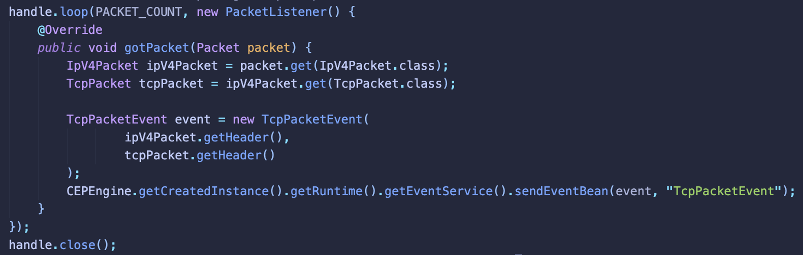

### 4.1. CEP engine initialisation
The CEPEngine is designed to have a higher level to the user can use it more easier than Esper CEP engine. 
In particular, the CEPEngine is modularized:
- When you want to monitor a new system, then you create a new module. 
- When you want to modify an existed module, you modify the class of the existed module not the whole CEP engine.

By modularizing the CEP engine, when you modify or add new module. You will not break the CEPEngine code that is in stable. 
However, using the constructor of the CEPEngine class is not enough to get the CEP engine working. We need an initializer to manage the CEP engine - CEPEngineInitializer. It will be changed everytime we modify or add a new module to the CEP engine.

You need to follow these steps to get the CEP engine working:
- Step 1: register event type to the configuration class
- Step 2: create an instance of CEPEngine with above configuration
- Step 3: activate all modules of the CEP engine
- Step 4: activate all collectors to feed the CEP engine

Below is the sample code to initialize the CEP engine to get it fully working:
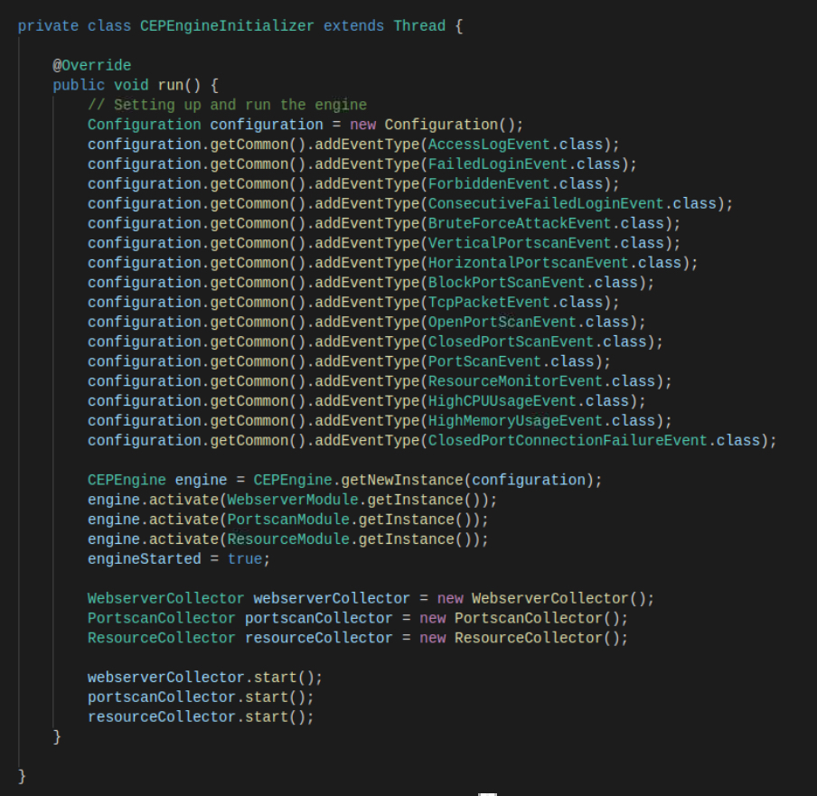

### 5. Validation

The SIEM system has a graphical user interface called Dashboard. In this Dashboard, it has below functionalities:

- configuring SIEM system
- setting alerts' priority
- showing number of processed events.
- displaying alerts

In this section, we will validate above functionalities by giving a short demo. Some cases will be validated very simple due to the validation steps are massive.

#### 5.1.  Validation of system settings and event statistics:

This section validates about:

- configuring SIEM system
- setting alerts' priority
- showing number of processed events.

##### 5.1.1. Configuring SIEM system

This part validates the network interface selection feature, it is one of many properties of the SIEM system. 

For example, this result show when the user choose an available network interface:

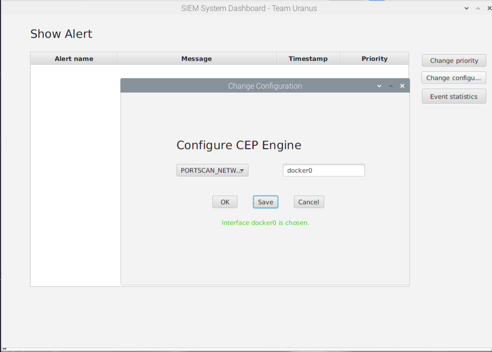

This case show when the user choose an unavailable network interface:

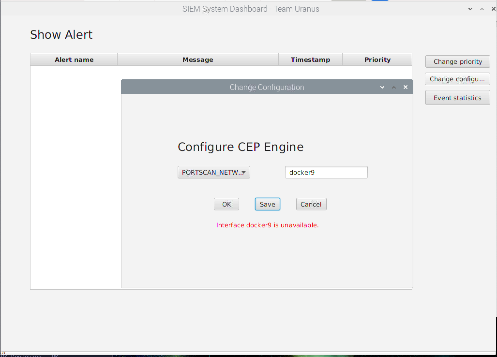

##### 5.1.2. Setting alerts' priority

This part validates changing the priority of an alert. For example, the block scan alert will be set to Medium. The chosen priority of the alert will be shown in section 5.2.3. Port scan detection.

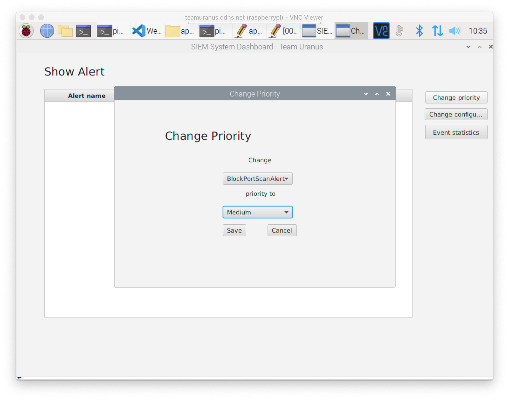

##### 5.1.3. Showing number of processed events

The number of events will be update in realtime. In the figure below, only the resouce event is sent to the CEP engine. Other events is not happened.

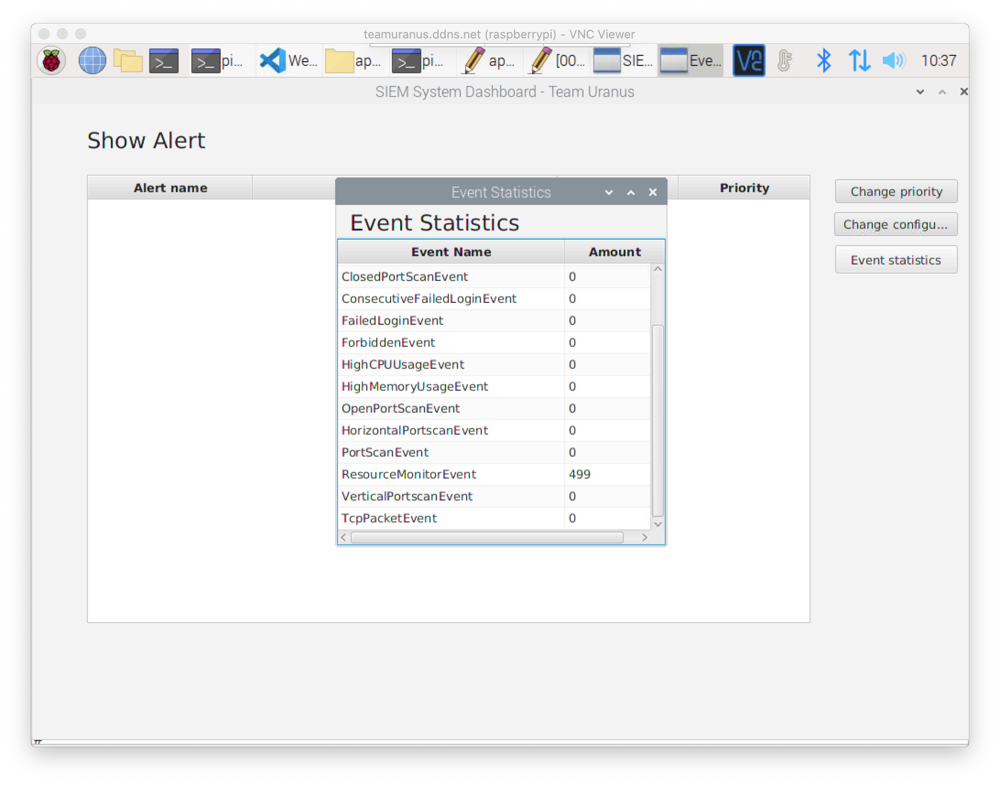

#### 5.2. Validation of system alerts:

##### 5.2.1. Webserver monitor

The figure below is our scenario, the SIEM system monitor our webserver, a webserver user manipulates with the webserver, alerts will be raised (if any) to the dashboard to users:

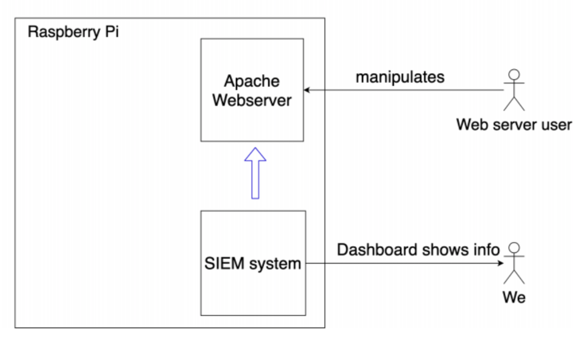

All alerts and their corresponding actions on the web server are:

- Failed login: user fails to authenticate him-/herself.
- Consecutive failed login: user exceeds 3 times of failed login.
- Brute force attack: user exceeds 10 times of failed login.
- Forbidden: user access the restricted resource.

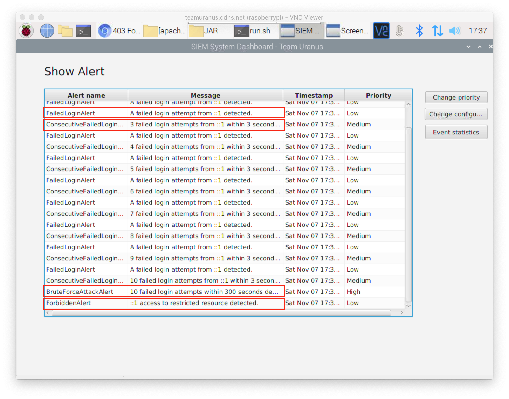

##### 5.2.2. System resource monitor

The figure below is our scenario, the SIEM system monitor our host machine resource, a user uses applications in the host machine, alerts will be raised (if any) to the dashboard to users:

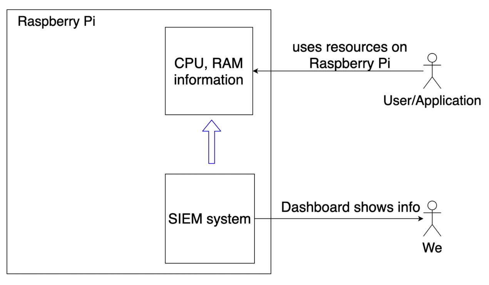

All alerts and corresponding actions with the host machine's resource are:

- High CPU usage: raise alerts if CPU load exceeds 80%
- High memory (RAM) usage: raise alerts if RAM load exceeds 40%.

Alerts shown on the SIEM system:

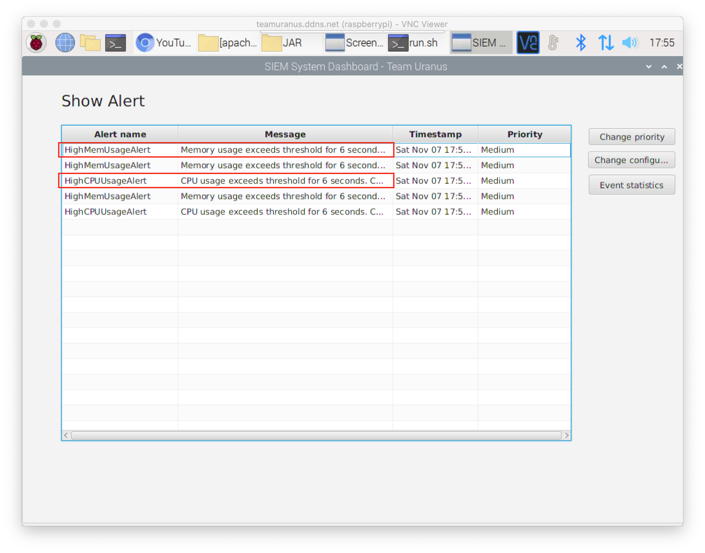

##### 5.2.3. Port scan detection

The figure below is our scenario, the SIEM system monitor the virtual netowrk, an attacker performs some port scanning methods, alerts will be raised (if any) to the dashboard to users:

All alerts and corresponding actions with the virtual network are:

- Vertical port scan alert: raise if a machine is scanned more than or equals 150 ports.
- Horizontal port scan alert: raise if multiple machines (more than or equal 3) are scanned on the same port.
- Block port scan alert: several machines are scanned on multiple ports.
- Application misconfiguration leads to scan on closed port alert: a machine trying to scan a port of a different machine more than or equal 5 times in 5 minutes.

Alerts shown on the SIEM system:

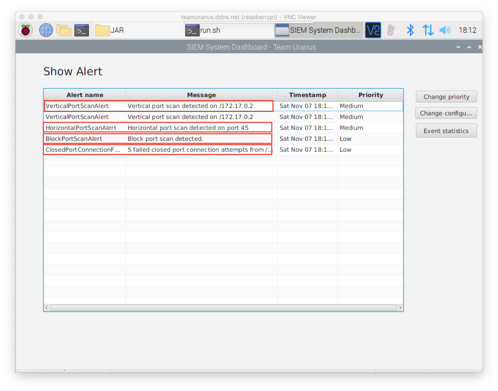

